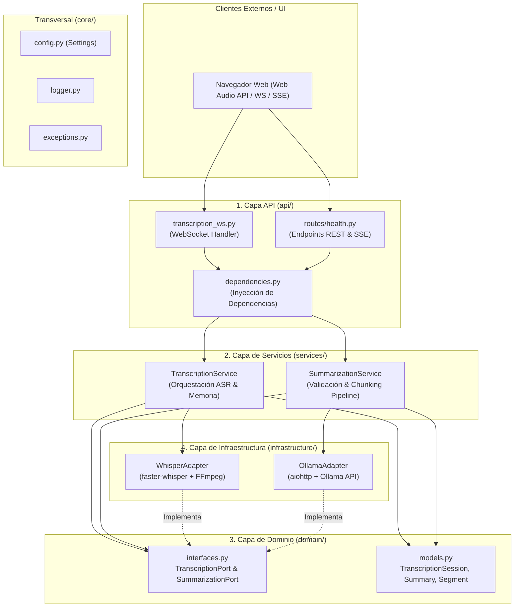
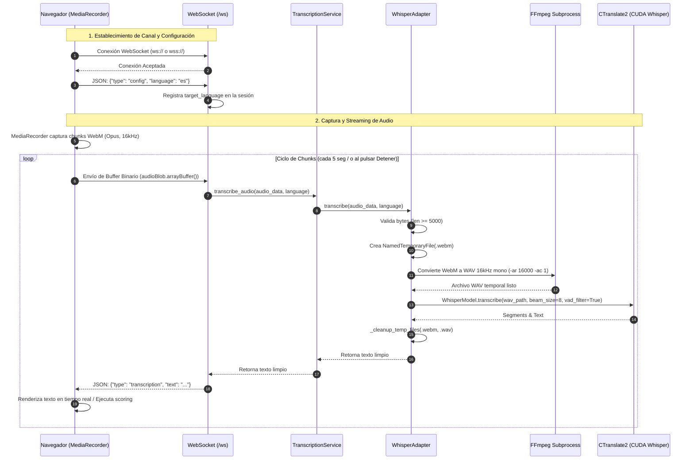
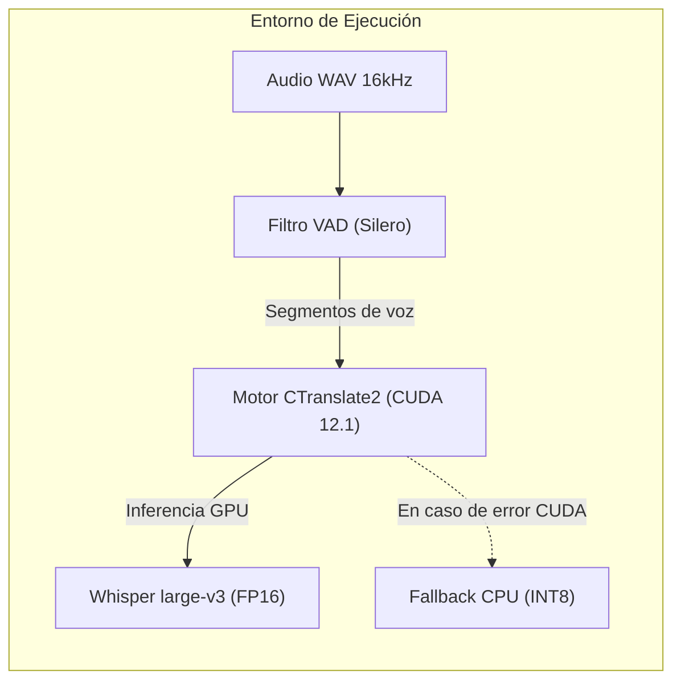
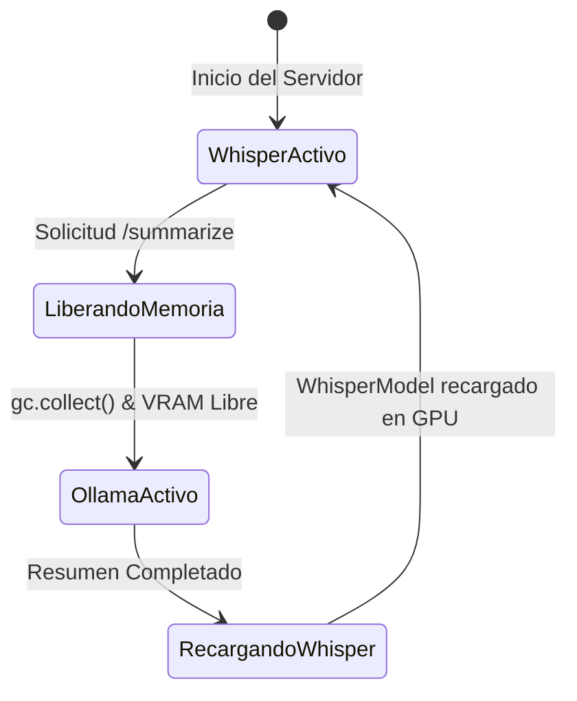
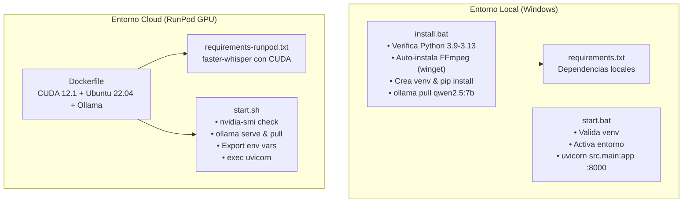

# REPORTE DE ARQUITECTURA Y FUNCIONAMIENTO TÉCNICO: ECHOCLASS (MVP)
**Documentación Técnica Oficial — Capítulo 2**

---

## 1. Estructura de Directorios y Patrón Arquitectónico (Clean Architecture)

El proyecto **EchoClass** está diseñado bajo los principios de **Clean Architecture** (Arquitectura Limpia / Puertos y Adaptadores), asegurando un desacoplamiento estricto entre el núcleo del dominio, los casos de uso, la infraestructura tecnológica (motores de IA y bibliotecas de audio) y los mecanismos de entrega (API REST, WebSockets y Frontend).

### 1.1 Mapeo de la Estructura del Repositorio

```text
EchoClass/
├── .env.example                       # Plantilla de variables de entorno (RunPod, Whisper, Ollama)
├── install.bat                        # Script de instalación y aprovisionamiento local (Windows)
├── start.bat                          # Script de arranque del servidor Uvicorn en Windows
├── requirements.txt                   # Dependencias base de Python para entorno local
├── rubrica.md                         # Rúbrica matemática y cualitativa para evaluación de pronunciación
├── vercel.json                        # Configuración para despliegue opcional de frontend estático
├── ARQUITECTURA.md                    # Reporte de Arquitectura y Funcionamiento Técnico
│
├── runpod/                            # Artefactos para despliegue en contenedores GPU (Cloud)
│   ├── Dockerfile                     # Imagen CUDA 12.1 + Ubuntu 22.04 + Ollama + Python 3.11
│   ├── requirements-runpod.txt        # Dependencias de producción para contenedor
│   ├── start.sh                       # Script de arranque y orquestación del Pod
│   └── DEPLOY.md                      # Manual operativo de despliegue en RunPod
│
├── static/                            # Frontend desacoplado (Vanilla SPA)
│   ├── config.js                      # Inyección dinámica de endpoints (HTTP/WS)
│   ├── index.html                     # Vista principal: Transcripción de clases y resúmenes
│   ├── app.js                         # Controlador frontend: WebSocket, audio y SSE
│   ├── practicar.html                 # Vista de práctica y scoring de pronunciación
│   ├── practicar.js                   # Controlador de pronunciación y algoritmo Levenshtein
│   └── styles.css                     # Sistema de diseño, tokens CSS y tema oscuro
│
└── src/                               # Backend modular (Clean Architecture)
    ├── __init__.py
    ├── main.py                        # Fábrica de aplicación FastAPI, ciclo de vida y middlewares
    │
    ├── core/                          # Núcleo transversal de la aplicación
    │   ├── __init__.py
    │   ├── config.py                  # Dataclasses de configuración centralizada desde variables de entorno
    │   ├── exceptions.py              # Jerarquía de excepciones de dominio y aplicación
    │   └── logger.py                  # Logger estructurado unificado
    │
    ├── domain/                        # Entidades puras y contratos (Puertos)
    │   ├── __init__.py
    │   ├── models.py                  # Modelos de datos (TranscriptionSession, Summary, etc.)
    │   └── interfaces.py              # Interfaces abstractas: TranscriptionPort, SummarizationPort
    │
    ├── infrastructure/                # Adaptadores tecnológicos externos
    │   ├── __init__.py
    │   ├── ai/
    │   │   ├── __init__.py
    │   │   ├── whisper_adapter.py     # Adaptador de ASR basado en faster-whisper (CTranslate2)
    │   │   └── ollama_adapter.py      # Adaptador de LLM local basado en Ollama (HTTP/REST)
    │   └── storage/
    │       └── __init__.py            # Módulo reservado para persistencia
    │
    ├── services/                      # Casos de uso y orquestación de negocio
    │   ├── __init__.py
    │   ├── transcription_service.py   # Orquestador del flujo de transcripción
    │   └── summarization_service.py   # Orquestador de síntesis de texto y map-reduce
    │
    └── api/                           # Capa de transporte y adaptadores primarios
        ├── __init__.py
        ├── dependencies.py            # Contenedor de inyección de dependencias (Singletons con lru_cache)
        ├── routes/
        │   ├── __init__.py
        │   └── health.py              # Endpoints REST (/api, /health, /summarize, /summarize/stream)
        └── websockets/
            ├── __init__.py
            └── transcription_ws.py    # Endpoint y manejador de streaming WebSocket bi-direccional
```

---

### 1.2 Responsabilidades por Capa en Clean Architecture



1. **`src/domain/` (Dominio Puro):**
   - **`interfaces.py`:** Define los puertos abstractos (`TranscriptionPort` y `SummarizationPort`) usando `abc.ABC`. No tiene dependencia de ninguna biblioteca de terceros ni de frameworks web.
   - **`models.py`:** Contiene las entidades puras del negocio: `TranscriptionSegment`, `TranscriptionSession`, `SessionStatus` y `Summary` con métodos de exportación a Markdown y texto plano.

2. **`src/services/` (Casos de Uso):**
   - **`transcription_service.py`:** La clase `TranscriptionService` implementa el caso de uso de transcripción. Se encarga de controlar el ciclo de vida del modelo en memoria (`initialize`, `free_memory`, `reload`), permitiendo liberar VRAM de la GPU cuando el LLM entra en ejecución.
   - **`summarization_service.py`:** La clase `SummarizationService` valida precondiciones mínimas de texto (`MIN_TEXT_LENGTH = 50`), verifica la disponibilidad del motor LLM y orquesta la generación simple o mediante streaming Server-Sent Events (SSE).

3. **`src/infrastructure/` (Adaptadores de Salida):**
   - **`ai/whisper_adapter.py`:** `WhisperAdapter` implementa `TranscriptionPort`. Encapsula `faster-whisper`, la conversión de audio mediante subprocesos de `ffmpeg`, y la gestión de fallos de GPU con fallback a CPU.
   - **`ai/ollama_adapter.py`:** `OllamaAdapter` implementa `SummarizationPort`. Encapsula la comunicación HTTP asíncrona vía `aiohttp` con la API nativa de Ollama (`/api/generate` y `/api/tags`), además de implementar la lógica jerárquica de *chunking* y consolidación.

4. **`src/api/` (Adaptadores de Entrada):**
   - **`routes/health.py`:** Endpoints REST para metadata de la API (`/api`), monitor de salud de servicios (`/health`), resumen síncrono (`/summarize`) y streaming de eventos SSE (`/summarize/stream`).
   - **`websockets/transcription_ws.py`:** Clase `TranscriptionWebSocket` encargada de mantener el canal de comunicación bidireccional continuo para la recepción de audio en bytes y el envío de texto transcrito en formato JSON.
   - **`dependencies.py`:** Inyección de dependencias usando `@lru_cache()` para asegurar instancias singleton de los servicios de aplicación.

5. **`src/core/` (Aspectos Transversales):**
   - **`config.py`:** Dataclasses fuertemente tipadas (`WhisperConfig`, `OllamaConfig`, `ServerConfig`, `RunPodConfig`, `Settings`) cargadas automáticamente desde variables de entorno.
   - **`exceptions.py`:** Jerarquía estandarizada que hereda de `EchoClassError` (`TranscriptionError`, `ModelNotLoadedError`, `SummarizationError`, `OllamaConnectionError`).
   - **`logger.py`:** Configuración unificada de logs enviada a `sys.stdout`.

---

## 2. Flujo de Datos End-to-End en Tiempo Real

El sistema implementa dos modalidades de captura y transmisión continua de audio: el modo **Transcripción de Clase Continua** (`app.js`) y el modo **Práctica de Pronunciación** (`practicar.js`).



### Detalle Técnico Paso a Paso

#### 1. Captura de audio en el navegador (Web Audio API / MediaRecorder)
- **Acceso a dispositivos:** Se invoca `navigator.mediaDevices.getUserMedia()` (para micrófono) o `navigator.mediaDevices.getDisplayMedia()` (para audio del sistema en el tab del navegador):
  ```javascript
  this.audioStream = await navigator.mediaDevices.getUserMedia({ 
      audio: {
          echoCancellation: true,
          noiseSuppression: true,
          sampleRate: 16000,
          channelCount: 1
      } 
  });
  ```
- **Codec y Contenedor:** Se prioriza `'audio/webm;codecs=opus'`.
- **Estrategia de fragmentación:**
  - En la transcripción general (`static/app.js`), se ejecuta una técnica de ciclo cerrado (`startRecordingCycle`) con ventanas temporales continuas de 5000 ms (`RECORDING_DURATION = 5000`). Cada ciclo inicializa un `MediaRecorder` y se detiene automáticamente a los 5 segundos para consolidar los headers EBML de WebM válidos y enviarlos como un bloque reproducible.
  - En la práctica de pronunciación (`static/practicar.js`), el `MediaRecorder` graba la locución completa sin *timeslice* hasta que el usuario presiona "Detener", asegurando la integridad estructural del contenedor WebM.

#### 2. Transmisión continua por WebSockets
- **Rutas de conexión:** En `src/main.py` se registran explícitamente tres rutas equivalentes vinculadas a `websocket_endpoint`:
  - `ws://<host>:<port>/`
  - `ws://<host>:<port>/ws` *(Ruta estándar utilizada por el frontend)*
  - `ws://<host>:<port>/ws/transcribe`
- **Manejo de conflictos con archivos estáticos:** El frontend SPA se monta sobre la raíz `/`. Para evitar que `StaticFiles` capture y rechace el handshake HTTP Upgrade del WebSocket con un error interno, se diseñó la subclase `SPAStaticFiles` en `src/main.py`:
  ```python
  class SPAStaticFiles(StaticFiles):
      async def __call__(self, scope, receive, send):
          if scope["type"] == "websocket":
              from starlette.responses import Response
              return await Response(status_code=404)(scope, receive, send)
          await super().__call__(scope, receive, send)
  ```
- **Protocolo de mensajes:**
  - *Mensajes de control (JSON Text):* Permite cambiar el idioma dinámicamente:
    `{"type": "config", "language": "es"}`
  - *Mensajes de audio (Binary Bytes):* Transmisión directa del ArrayBuffer del audio WebM mediante `ws.send(buffer)`.

#### 3. Recepción, buffering y conversión en el backend
- En `src/api/websockets/transcription_ws.py`:
  El método `handle` evalúa si el paquete recibido contiene bytes binarios.
- En `src/infrastructure/ai/whisper_adapter.py`:
  1. **Validación de tamaño:** Si el chunk tiene menos de 5.000 bytes (`len(audio_data) < 5000`), se descarta para evitar procesar ráfagas vacías o silencios corruptos.
  2. **Persistencia temporal:** Se escribe el buffer binario en un archivo temporal con sufijo `.webm`.
  3. **Normalización acústica con FFmpeg:** Se ejecuta un subproceso síncrono mediante `subprocess.run` con timeout de 10 segundos para transformar el audio a especificación estándar de reconocimiento de voz:
     ```bash
     ffmpeg -i input.webm -ar 16000 -ac 1 -f wav -y output.wav -loglevel error
     ```
     - Frecuencia de muestreo: **16.000 Hz** (`-ar 16000`).
     - Canales: **Mono** (`-ac 1`).

#### 4. Procesamiento GPU y retorno al cliente
- El archivo WAV normalizado es procesado por `WhisperModel.transcribe`.
- La respuesta procesada se serializa en JSON y se transmite de vuelta por el socket:
  ```json
  {
    "type": "transcription",
    "text": "Bienvenidos a la clase de hoy..."
  }
  ```
- Si el backend experimenta más de 3 fallos consecutivos (`MAX_CONSECUTIVE_ERRORS = 3`), notifica al cliente con una advertencia estructurada: `{"type": "warning", "message": "..."}`.

---

## 3. Integración y Configuración de los Motores de IA

EchoClass implementa un diseño de doble motor de Inteligencia Artificial: un modelo **ASR (Automatic Speech Recognition)** para la escucha y transcripción, y un modelo **LLM (Large Language Model)** para la síntesis conceptual y estructuración de información.

### 3.1 Motor ASR: faster-whisper

El módulo de transcripción no utiliza el paquete estándar `openai-whisper`, sino **`faster-whisper`** (versión $\ge 1.0.0$), una reimplementación optimizada basada en el motor de inferencia **CTranslate2**.



#### Parámetros Técnicos de Configuración
Definidos en `src/core/config.py` y consumidos por `src/infrastructure/ai/whisper_adapter.py`:

| Parámetro | Valor por Defecto | Variable de Entorno | Descripción Técnica |
| :--- | :--- | :--- | :--- |
| **`model_size`** | `"large-v3"` | `WHISPER_MODEL` | Arquitectura Whisper de ~1550M de parámetros para máxima precisión fonética multilingüe. |
| **`device`** | `"cuda"` | `WHISPER_DEVICE` | Aceleración por hardware sobre GPU NVIDIA. Fallback dinámico a `"cpu"`. |
| **`compute_type`** | `"float16"` | `WHISPER_COMPUTE_TYPE` | Precisión de cómputo en punto flotante de 16 bits para GPU. En fallback CPU conmuta automáticamente a `"int8"`. |
| **`language`** | `"es"` | `WHISPER_LANGUAGE` | Idioma primario de decodificación. Soporta selección dinámica por WebSocket (`en`, `pt`, `zh`, `ru`). |
| **`cpu_threads`** | `4` | `WHISPER_CPU_THREADS` | Cantidad de hilos de ejecución cuando el motor opera en modo CPU. |
| **`num_workers`** | `2` | `WHISPER_NUM_WORKERS` | Cantidad de hilos de cómputo de CTranslate2 para pre-procesamiento e inferencia. |

#### Parámetros de Inferencia en Tiempo Real
En la llamada a `self._model.transcribe()` (`whisper_adapter.py`):
- **`beam_size=8`**: Búsqueda por haz expandida a 8 rutas para maximizar la exactitud de reconocimiento léxico.
- **`best_of=5`**: Selección del mejor candidato entre 5 hipótesis generadas.
- **`temperature=0.0`**: Decodificación totalmente determinista (greedy search) que evita alucinaciones o derivaciones estocásticas.
- **`patience=1.5`**: Factor de paciencia en beam search para evaluar secuencias completas antes de cerrar el haz.
- **`condition_on_previous_text=False`**: Evita la retroalimentación de transcripciones pasadas. En transcripciones de chunks aislados en tiempo real, esto evita bucles de repetición infinita.
- **`vad_filter=True`**: Activación del filtro Voice Activity Detection (Silero VAD integrado) para descartar silencios y ruido ambiente antes del procesamiento en la red neuronal.
  - `vad_parameters=dict(min_silence_duration_ms=300, speech_pad_ms=250)`.

#### Mecanismo de Fallback Automático y Gestión de VRAM
En `WhisperAdapter.load_model`:
Si la inicialización con `device="cuda"` falla por falta de drivers NVIDIA, bibliotecas CUDA o memoria insuficiente, el adaptador captura la excepción de forma transparente, conmuta `device="cpu"` y `compute_type="int8"`, e inicializa el modelo cuantizado en CPU sin interrumpir el arranque del servidor.

---

### 3.2 Motor LLM: Ollama (Qwen 2.5)

La síntesis semántica de clases y estructuración de información es provista por **Ollama** actuando como servidor local de inferencia de LLMs.

#### Parámetros Técnicos
Definidos en `OllamaConfig` y `OllamaAdapter`:
- **Modelo:** `qwen2.5:7b` (configurable mediante `OLLAMA_MODEL`). Modelo de Alibaba Cloud de 7 billones de parámetros con capacidades avanzadas de razonamiento en español y seguimiento riguroso de plantillas Markdown.
- **Base URL:** `http://localhost:11434` (configurable mediante `OLLAMA_URL`).
- **Timeout:** `300` segundos (5 minutos por llamada).
- **Endpoints consumidos:**
  - `GET http://localhost:11434/api/tags`: Utilizado en `is_available()` para comprobar el estado de salud de Ollama.
  - `POST http://localhost:11434/api/generate`: Consumido con payload JSON:
    ```json
    {
      "model": "qwen2.5:7b",
      "prompt": "<PROMPT_ESTRUCTURADO>",
      "stream": false,
      "options": {
        "temperature": 0.3,
        "top_p": 0.9,
        "num_predict": 2500
      }
    }
    ```

#### Orquestación de Memoria VRAM Compartida (GPU Offloading)
En entornos con una sola GPU (por ejemplo, 16GB o 24GB de VRAM en RunPod), cargar simultáneamente `Whisper large-v3` (~10 GB de VRAM) y `qwen2.5:7b` (~5.5 GB de VRAM en 4-bit) puede causar un error de *CUDA Out of Memory*. 

Para resolver esto, en `src/api/routes/health.py` y en el flujo SSE (`summarize_text_stream`), se implementó un mecanismo de **conmutación de memoria VRAM**:
1. Antes de invocar al LLM, se ejecuta `transcription_svc.free_memory()`, llamando a `del self._model` y `gc.collect()` para desalojar Whisper de la memoria de video.
2. Se ejecuta la inferencia de Ollama en GPU con la totalidad de la VRAM disponible.
3. Al finalizar la generación del resumen (incluso en bloques `finally`), se ejecuta `transcription_svc.reload()`, recargando Whisper para continuar la transcripción en vivo.



#### Estructura de Prompts y Pipeline de Resúmenes
En `src/infrastructure/ai/ollama_adapter.py`, el procesamiento varía según la extensión del texto:

1. **Transcripciones cortas ($\le 2.800$ caracteres / ~700 tokens):**
   Se utiliza el prompt directo de `_build_summary_prompt`, exigiendo un formato Markdown estricto de 4 secciones académicas:
   - `## Resumen:` (1-2 líneas con la idea central).
   - `## Claves:` (3 a 5 puntos concretos).
   - `## Decisión/impacto:` (conclusión principal o implicación práctica).
   - `## Siguiente paso:` (acción concreta recomendada).

2. **Transcripciones largas ($> 2.800$ caracteres) — Map-Reduce Jerárquico:**
   - **Fase de Chunking (`_split_into_chunks`):** Divide el texto en fragmentos de hasta `CHUNK_SIZE_CHARS = 1800` caracteres preservando los límites oracionales mediante la expresión regular `(?<=[.!?])\s+`.
   - **Fase Map (`_summarize_chunk`):** Resume cada chunk $i$ de $N$ extrayendo conceptos principales, explicaciones, ejemplos y tareas (`num_predict=650`).
   - **Fase Reduce (`_consolidate_summaries`):** Agrupa resúmenes parciales en lotes de hasta `MAX_SUMMARIES_PER_BATCH = 3` (`MAX_BATCH_INPUT_CHARS = 3800`) y los consolida jerárquicamente en rondas sucesivas.
   - **Fallback Recursivo ante Timeouts (`_consolidate_with_retry`):** Si un lote excede el tiempo límite de Ollama, se divide automáticamente en mitades y se sintetiza recursivamente.

---

### 3.3 Evaluación de Pronunciación (Whisper + Algoritmo Fonético de Levenshtein)

En el MVP de EchoClass, la evaluación de pronunciación se implementa desacoplando el reconocimiento acústico de alta fidelidad del cómputo métrico de similitud. El motor Whisper realiza la decodificación fonética de lo emitido por el usuario, y el motor del cliente (`static/practicar.js`), contrastado con `rubrica.md`, calcula el puntaje objetivo en escala de 1 a 10.

#### Formulación Matemática del Scoring
1. **Normalización de Texto:**
   Se eliminan diacríticos, mayúsculas, espacios redundantes y puntuación:
   $$\text{texto}_{\text{limpio}} = \text{normalizar}(\text{texto})$$
   En JavaScript: `.toLowerCase().normalize('NFD').replace(/[\u0300-\u036f]/g, '').replace(/[.,\/#!$%\^&\*;:{}=\-_`~()?'"¡!¿?]/g, '')`.

2. **Distancia de Edición ($D$):**
   Calculada mediante la **Distancia de Levenshtein** en una matriz bidimensional $M$:
   $$D = \text{Levenshtein}(\text{objetivo}_{\text{norm}}, \text{transcripción}_{\text{norm}})$$

3. **Similitud Normalizada ($S$):**
   $$S = \max\left(0, 1 - \frac{D}{\max(\text{len}(\text{objetivo}), \text{len}(\text{transcripción}))}\right)$$

#### Escala Oficial de Calificación (1 a 10)
Implementada en `calculateScore` (`static/practicar.js`):

| Calificación | Rango de Similitud ($S$) | Nivel / Título | Descripción de Feedback |
| :---: | :---: | :---: | :--- |
| **10 / 10** | $S \ge 0.95$ | **¡Excelente! 🎯** | Pronunciación perfecta o con variaciones imperceptibles. |
| **9 / 10** | $0.85 \le S < 0.95$ | **¡Sobresaliente!** | Pronunciación muy clara. Pequeña diferencia en acento o consonante. |
| **8 / 10** | $0.75 \le S < 0.85$ | **¡Muy Bueno!** | Comprensión alta con ligera imprecisión fonética. |
| **7 / 10** | $0.65 \le S < 0.75$ | **Bueno** | Comprensible, pero con acento o desviación en algunas letras. |
| **6 / 10** | $0.55 \le S < 0.65$ | **Aceptable** | Se entiende la intención; pronunciación requiere mejorar. |
| **5 / 10** | $0.45 \le S < 0.55$ | **Regular** | Aproximación básica; varias sílabas deformadas. |
| **4 / 10** | $0.35 \le S < 0.45$ | **Deficiente** | Pronunciación confusa o palabra escuchada de forma incompleta. |
| **3 / 10** | $0.25 \le S < 0.35$ | **Insuficiente** | Ruido o sonido alejado de la palabra objetivo. |
| **2 / 10** | $0.10 \le S < 0.25$ | **Muy Bajo** | Prácticamente no coincide con la palabra esperada. |
| **1 / 10** | $S < 0.10$ | **Sin Coincidencia** | No se escuchó audio inteligible o no hubo sonido capturado. |

---

## 4. Frontend y Decoupling de Configuración

El frontend de EchoClass es una **Single Page Application (SPA) en Vanilla Web Standards** (HTML5 semántico, CSS3 moderno y JavaScript ES6+ sin transpiladores ni bundlers pesados), permitiendo máxima velocidad de carga y portabilidad tanto local como en la nube.

### 4.1 Estructura del Frontend Estático
- **`static/index.html`:** Interfaz principal de clase. Incluye selector dinámico de idioma (`#transcriptionLang`), controles de grabación (micrófono y audio de sistema), área de pruebas para pegar texto manual (`#pasteArea`), visualizador de transcripción en tiempo real con contador de caracteres (`#charCount`), panel de progreso del pipeline de resumen (`#progressContainer`) y visor de Markdown generado.
- **`static/practicar.html`:** Módulo de evaluación de pronunciación. Contiene el input de palabra/frase objetivo (`#targetWord`), selector de idioma con indicadores dinámicos de fidelidad Whisper, caja de transcripción fonética y tarjeta de resultados (`#evaluationCard`) con score badge interactivo.
- **`static/styles.css`:** Hoja de estilos con variables de color (dark palette `--bg-primary: #0f172a`, `--accent-primary: #3b82f6`, gradientes para badges), diseño responsivo con media queries y animaciones de pulsación de grabación.
- **`static/app.js` y `static/practicar.js`:** Clases controladoras orientadas a objetos (`TranscriptionApp` y `PracticeApp`).

---

### 4.2 Mecanismo de Inyección Dinámica y Desacoplamiento de Red

El desacoplamiento de configuración se resuelve mediante el archivo **`static/config.js`**, el cual debe ser cargado en el HTML estrictamente **antes** de los scripts de aplicación:

```html
<!-- Carga de configuración antes de la lógica de negocio -->
<script src="config.js"></script>
<script src="app.js"></script>
```

#### Contenido de `static/config.js`
```javascript
window.ECHOCLASS_CONFIG = {
  serverUrl: "",
  wsUrl:     ""
};
```

#### Lógica de Resolución Dinámica en los Controladores
Tanto en `app.js` como en `practicar.js`, los constructores resuelven los endpoints de forma adaptativa:

```javascript
const _cfg = window.ECHOCLASS_CONFIG || {};

// Resolución de URL HTTP para endpoints REST y SSE
this.SERVER_URL = (_cfg.serverUrl || '')
    ? _cfg.serverUrl.replace(/\/+$/, '')
    : window.location.origin;

// Resolución de URL WebSocket con conmutación automática ws:// vs wss://
this.WS_URL = (_cfg.wsUrl || '')
    ? _cfg.wsUrl.replace(/\/+$/, '')
    : (window.location.protocol === 'https:' ? 'wss://' : 'ws://') + window.location.host + '/ws';
```

#### Beneficios del Patrón de Desacoplamiento:
1. **Modo Contenedor / Despliegue Unificado (RunPod o Local):** Si `serverUrl` y `wsUrl` se dejan vacíos (`""`), el frontend asume automáticamente el origen desde donde fue servido (`window.location`). Si se navega vía `https://`, conmuta automáticamente a WebSockets seguros (`wss://`).
2. **Modo Frontend Desacoplado (ej. Vercel, Netlify o localhost):** Si el frontend se hospeda en una CDN y el backend corre en un pod GPU de RunPod, solo se debe especificar en `config.js`:
   ```javascript
   window.ECHOCLASS_CONFIG = {
     serverUrl: "https://xxxxxx-8000.proxy.runpod.net",
     wsUrl:     "wss://xxxxxx-8000.proxy.runpod.net/ws"
   };
   ```
   Sin necesidad de recompilar ningún archivo ni alterar el código fuente.

---

## 5. Configuración de Entornos y Archivos de Ejecución

EchoClass cuenta con configuraciones para dos entornos principales: **entorno local sobre Windows** (orientado al desarrollo y pruebas en estaciones de trabajo) y **entorno en la nube sobre contenedores GPU en RunPod** (orientado a producción y cargas pesadas con GPU dedicadas).



### 5.1 Scripts de Ejecución Local (Windows)

#### `install.bat`
Script interactivo y automatizado de aprovisionamiento en 4 etapas:
1. **Validación de Entorno de Ejecución:** Detecta si se está ejecutando dentro de la terminal de VS Code y advierte sobre bloqueos en variables de entorno (`PATH`).
2. **Verificación de Python:** Comprueba que la versión esté en el rango de compatibilidad `[3.9, 3.13)` (bloquea la 3.14 por incompatibilidades con wheels de Torch/CTranslate2). Si no existe Python, ejecuta `winget install --id Python.Python.3.12 -e`.
3. **Verificación e Instalación de FFmpeg:** Valida la disponibilidad de `ffmpeg` en el sistema. En caso de ausencia, utiliza el gestor de paquetes de Windows: `winget install --id Gyan.FFmpeg -e`.
4. **Entorno Virtual y Dependencias:** Comprueba la integridad de `venv/Scripts/activate.bat`. Si está corrupto o desactualizado respecto al intérprete, lo recrea e instala `requirements.txt`.
5. **Verificación de Ollama:** Comprueba la presencia de la CLI `ollama` y ejecuta `ollama pull qwen2.5:7b` para precargar el modelo LLM en el disco local.

#### `start.bat`
Script de arranque del servidor para Windows:
1. Valida que el entorno virtual `venv` exista y que `venv\Scripts\python.exe` responda correctamente.
2. Activa el entorno mediante `call venv\Scripts\activate.bat`.
3. Verifica la presencia de dependencias críticas (`fastapi`). Si faltan, repara silenciosamente con `pip install -r requirements.txt`.
4. Lanza el servidor ASGI en modo producción local:
   ```cmd
   python -m uvicorn src.main:app --host 0.0.0.0 --port 8000
   ```

#### `requirements.txt`
Define las dependencias requeridas para la ejecución local:
- `fastapi>=0.115.0` y `uvicorn[standard]>=0.30.0`: Framework API y servidor ASGI de alto rendimiento.
- `websockets>=13.0`: Protocolo WebSocket bidireccional.
- `faster-whisper>=1.0.0`: Motor de inferencia ASR basado en CTranslate2.
- `pydub>=0.25.0` y `numpy>=1.26.0`: Manipulación y buffers de audio.
- `aiohttp>=3.9.0`: Cliente HTTP asíncrono para comunicarse con el demonio de Ollama.
- `python-multipart>=0.0.9`: Parseo de peticiones HTTP multipart/form-data.

---

### 5.2 Archivos de Despliegue en la Nube (RunPod / Contenedores GPU)

#### `runpod/Dockerfile`
Configura una imagen de contenedor optimizada para aceleración por GPU:
1. **Imagen Base:** `nvidia/cuda:12.1.0-cudnn8-runtime-ubuntu22.04`, compatible con la mayoría de GPUs modernas (RTX 3090, RTX 4090, A40, A100).
2. **Variables de Entorno Base:**
   - `DEBIAN_FRONTEND=noninteractive`
   - `OLLAMA_MODELS=/root/.ollama/models` (almacenamiento en caché del modelo LLM).
   - `WHISPER_CACHE=/root/.cache/huggingface/hub` (almacenamiento en caché del modelo Whisper).
3. **Instalación de Paquetes del Sistema:** Python 3.11, Python 3.11-venv, FFmpeg, cURL, Wget, CA-Certificates.
4. **Instalación de Ollama:** `RUN curl -fsSL https://ollama.com/install.sh | sh`.
5. **Caché de Capas de Python:** Copia `runpod/requirements-runpod.txt` e instala dependencias antes de copiar el código fuente, optimizando tiempos de rebuild.
6. **Código y Permisos:** Copia `src/` y `static/`, otorga permisos de ejecución a `runpod/start.sh` y expone el puerto `8000`.

#### `runpod/requirements-runpod.txt`
Similar a `requirements.txt`, optimizado para compilar CTranslate2 sobre CUDA 12.1 y cuDNN 8.

#### `runpod/start.sh`
Script de orquestación de servicios dentro del pod de RunPod:
1. **Detección de GPU:** Ejecuta `nvidia-smi --query-gpu=name,memory.total --format=csv,noheader` para validar el dispositivo CUDA activo.
2. **Arranque en Segundo Plano de Ollama:** Ejecuta `ollama serve &` y guarda su PID (`OLLAMA_PID=$!`).
3. **Health Check Activo de Ollama:** Ejecuta un bucle `until curl -sf http://localhost:11434/api/tags` con hasta 30 intentos (intervalo de 2s) esperando a que el servicio esté operativo.
4. **Precarga del Modelo LLM:** Comprueba mediante `ollama list` si `qwen2.5:7b` ya se encuentra descargado; de lo contrario, ejecuta `ollama pull qwen2.5:7b`.
5. **Configuración de Variables de Entorno para Whisper:**
   - `WHISPER_MODEL=large-v3`
   - `WHISPER_DEVICE=cuda`
   - `WHISPER_COMPUTE_TYPE=float16`
   - `WHISPER_LANGUAGE=es`
6. **Ejecución del Servidor:** Reemplaza el proceso del shell con `exec python -m uvicorn src.main:app --host 0.0.0.0 --port "${SERVER_PORT:-8000}" --log-level info`.

#### `runpod/DEPLOY.md`
Manual operativo que documenta el ciclo de vida del despliegue:
- Construcción y publicación de la imagen en Docker Hub:
  `docker build -f runpod/Dockerfile -t TU_USUARIO/echoclass:latest .`
- Especificación mínima recomendada de Pod: GPU con al menos **16 GB de VRAM** (RTX 3090 / RTX 4090) y **30 GB de Container Disk** persistente para alojar las capas de HuggingFace Hub y Ollama Models.
- Protocolo de conexión segura de RunPod Proxy (`https://XXXXXXXX-8000.proxy.runpod.net` y `wss://XXXXXXXX-8000.proxy.runpod.net/ws`).

---

## 6. Resumen de Especificaciones Técnicas (Ficha de Referencia)

| Componente | Tecnología Seleccionada | Archivo de Implementación | Observaciones Clave |
| :--- | :--- | :--- | :--- |
| **Framework Web Backend** | FastAPI 0.115+ / Uvicorn | `src/main.py` | Lifespan context para modelos; SPAStaticFiles para WS. |
| **Motor ASR (Voz a Texto)** | faster-whisper (CTranslate2) | `whisper_adapter.py` | Modelo `large-v3`, `float16`, VAD Silero, fallback a CPU. |
| **Motor LLM (Resumen)** | Ollama (`qwen2.5:7b`) | `ollama_adapter.py` | Inferencia local `/api/generate`, chunking de 1800 caracteres. |
| **Pipeline de Audio** | FFmpeg (CLI) | `whisper_adapter.py` | Conversión WebM/Opus a WAV 16kHz mono sin compresión. |
| **Gestión de VRAM** | Dynamic VRAM Offloading | `routes/health.py` | Descarga Whisper antes del LLM y lo recarga posteriormente. |
| **Métrica de Pronunciación** | Levenshtein Normalizada | `practicar.js` / `rubrica.md` | Escala de 1 a 10 con 10 umbrales de similitud fonética. |
| **Frontend SPA** | Vanilla HTML5 / CSS3 / ES6 | `static/` | Desacoplado de la API mediante `static/config.js`. |
| **Contenedor GPU** | Docker (CUDA 12.1 + cuDNN 8) | `runpod/Dockerfile` | Base Ubuntu 22.04 con Ollama y FFmpeg preinstalados. |
