# 🚀 GUÍA Y MANUAL DE DESPLIEGUE: ECHOCLASS EN RUNPOD GPU
**Bitácora Técnica Paso a Paso: De Docker Local a Producción en la Nube con GPU**

---

## 📌 1. Introducción y Arquitectura del Despliegue

Este manual documenta de forma gráfica y detallada el proceso completo realizado para empaquetar, publicar y desplegar el sistema **EchoClass (MVP)** en la nube de cómputo GPU de **RunPod**, permitiendo la inferencia en tiempo real de **Whisper (`large-v3`)** y **Ollama (`qwen2.5:7b`)** sobre una tarjeta **NVIDIA RTX A5000 (24 GB VRAM)**.

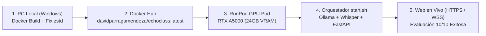

---

## 🛠️ 2. Fase 1: Compilación Local de la Imagen Docker

### 2.1 El Dockerfile y la solución al error `zstd`
Para que el contenedor soporte aceleración por hardware e incluya todos los motores en una sola imagen, se construyó sobre la base oficial de NVIDIA:

```dockerfile
FROM nvidia/cuda:12.1.0-cudnn8-runtime-ubuntu22.04
```

Durante el primer intento de compilación (`docker build`), el script oficial de Ollama falló con el siguiente error:
```text
>>> Installing ollama to /usr/local
ERROR: This version requires zstd for extraction. Please install zstd and try again:
  - Debian/Ubuntu: sudo apt-get install zstd
```

**Solución aplicada en `runpod/Dockerfile`:**
Se agregaron `zstd` y las bibliotecas estándar de Python al gestor de paquetes de Ubuntu:
```dockerfile
RUN apt-get update && apt-get install -y --no-install-recommends \
        python3 \
        python3-dev \
        python3-pip \
        python3-venv \
        ffmpeg \
        curl \
        wget \
        ca-certificates \
        git \
        zstd \
    && apt-get clean \
    && rm -rf /var/lib/apt/lists/*
```

### 2.2 Compilación exitosa
Con el comando ejecutado en la raíz del proyecto:
```bash
docker build -f runpod/Dockerfile -t davidparragamendoza/echoclass:latest .
```
Docker aprovechó la caché de la capa base de NVIDIA CUDA (1.29 GB) y completó la compilación de la imagen en su totalidad.

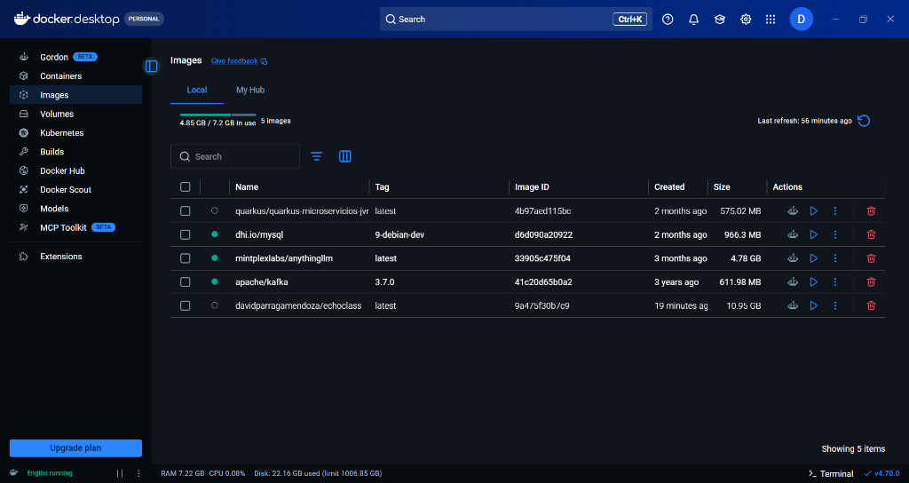
*Figura 1: Imagen local `davidparragamendoza/echoclass:latest` creada con éxito en Docker Desktop (10.95 GB descomprimida).*

---

## ☁️ 3. Fase 2: Publicación en Docker Hub

Para que RunPod pueda instanciar el contenedor en un centro de datos remoto, la imagen debe estar disponible en un registro público.

### 3.1 Subida con `docker push`
Estando autenticado en Docker Desktop con la cuenta vinculada a GitHub (`davidparragamendoza`), se ejecutó:

```bash
docker push davidparragamendoza/echoclass:latest
```

Docker comprimió y subió las 19 capas del contenedor.

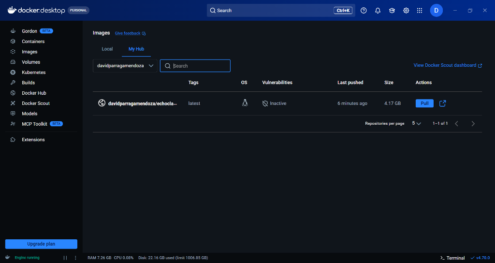
*Figura 2: Repositorio público en Docker Hub confirmando la imagen lista con un peso comprimido de 4.17 GB.*

### 3.2 Liberación de Memoria RAM Local (`VmmemWSL`)
Durante el proceso de compilación, el motor de virtualización de Docker en Windows (`VmmemWSL`) reservó más de **7.000 MB (7 GB)** de memoria RAM en la máquina local.

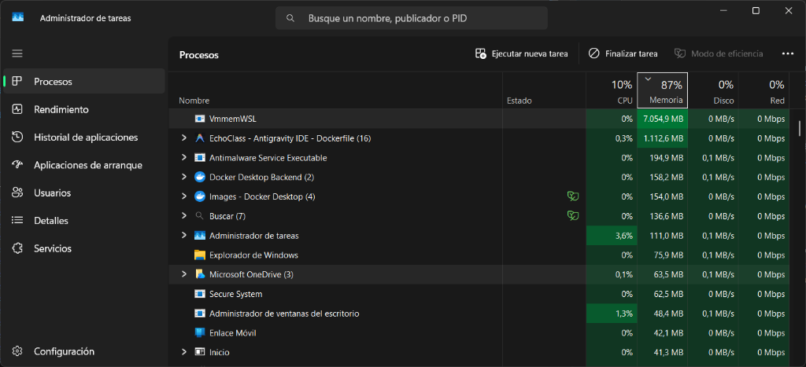
*Figura 3: Administrador de Tareas mostrando 7 GB retenidos por `VmmemWSL`. Al cerrar Docker Desktop, la RAM de la laptop se liberó por completo ya que el procesamiento futuro correrá en la nube.*

---

## ⚡ 4. Fase 3: Selección de GPU y Configuración en RunPod

### 4.1 Elección de la GPU
En la consola de [RunPod](https://www.runpod.io/console/pods), se seleccionó una instancia de la categoría **Community Cloud**:
- **GPU:** NVIDIA RTX A5000
- **VRAM:** 24 GB GDDR6 (capacidad de sobra para Whisper `large-v3` ~8 GB y Ollama `qwen2.5:7b` ~5.5 GB)
- **RAM del Sistema:** 48 GB RAM • 9 vCPUs
- **Costo:** **$0.27 USD / hora** (permitiendo más de 6 horas de uso continuo con un saldo de $1.81).

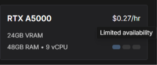
*Figura 4: Especificaciones de la tarjeta gráfica RTX A5000 seleccionada.*

---

### 4.2 Ajuste del Workload y Template Overrides

Al iniciar la configuración, la plantilla por defecto apuntaba a una imagen genérica de PyTorch (`runpod/pytorch:...`):

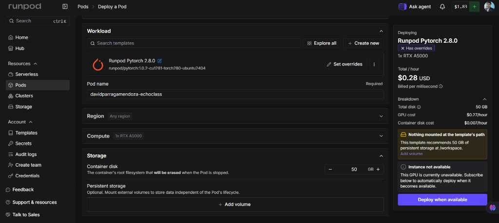
*Figura 5: Pantalla principal de despliegue donde se personalizó el almacenamiento a 50 GB y se accedió a "Set overrides".*

Al hacer clic en el botón con el lápiz **`Set overrides`**, se configuraron los parámetros específicos de EchoClass:

1. **Container Image:** Se reemplazó la imagen por defecto por:
   ```text
   davidparragamendoza/echoclass:latest
   ```
2. **Jupyter Notebook:** Se **desmarcó** la casilla `Start Jupyter notebook` para evitar que el contenedor sobreescriba el comando de inicio e impida ejecutar `start.sh`.
3. **Exposed HTTP Ports:** Se eliminó el puerto `8888` y se configuró el puerto **`8000`** (puerto nativo de FastAPI).

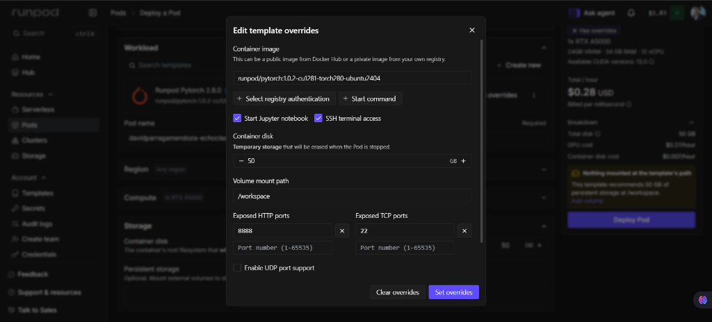
*Figura 6: Ventana de "Edit template overrides" con la configuración del puerto 8000.*

---

### 4.3 Inyección de Variables de Entorno

En la sección inferior del modal, se desplegó el panel de **Environment variables**:

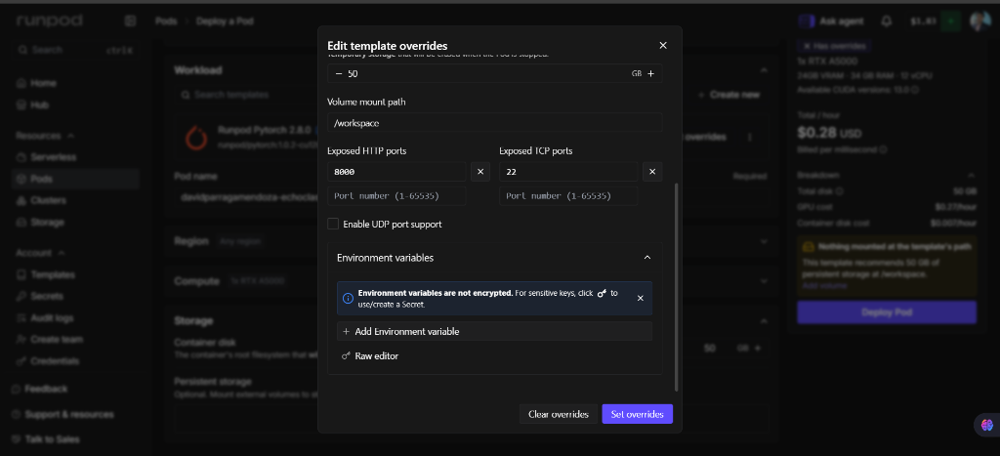
*Figura 7: Opción "Raw editor" para edición masiva de variables de entorno.*

Haciendo clic en **`Raw editor`**, se pegó el bloque completo de configuración:

```env
WHISPER_MODEL=large-v3
WHISPER_DEVICE=cuda
WHISPER_COMPUTE_TYPE=float16
WHISPER_LANGUAGE=es
OLLAMA_MODEL=qwen2.5:7b
```

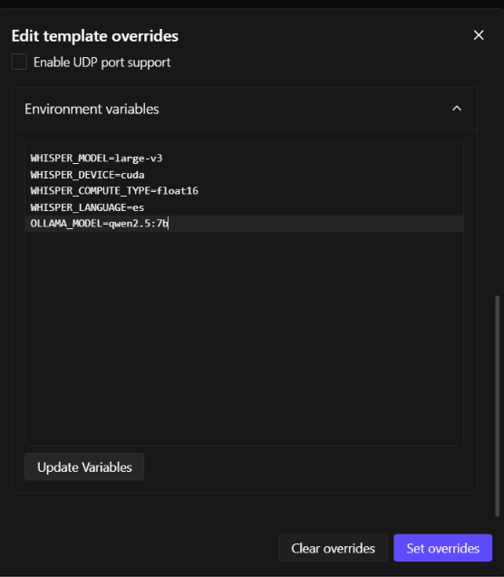
*Figura 8: Pegado directo de las 5 variables de entorno.*

> 💡 **Paso clave descubierto en el proceso:** Fue indispensable pulsar el botón **`Update Variables`** para que los valores de texto plano se parsearan en el formulario estructurado de RunPod antes de guardar con `Set overrides`.

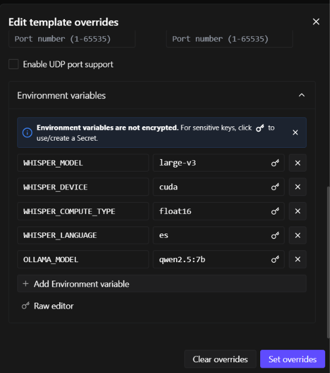
*Figura 9: Variables de entorno validadas y listas para ser inyectadas al contenedor.*

---

## 🚀 5. Fase 4: Despliegue y Orquestación Autónoma

Al hacer clic en **`Deploy Pod`**, RunPod inició el aprovisionamiento de la máquina:

### 5.1 Descarga de capas a alta velocidad
Gracias a la conectividad de centros de datos de RunPod, la imagen de 4.17 GB se descargó en menos de 90 segundos:

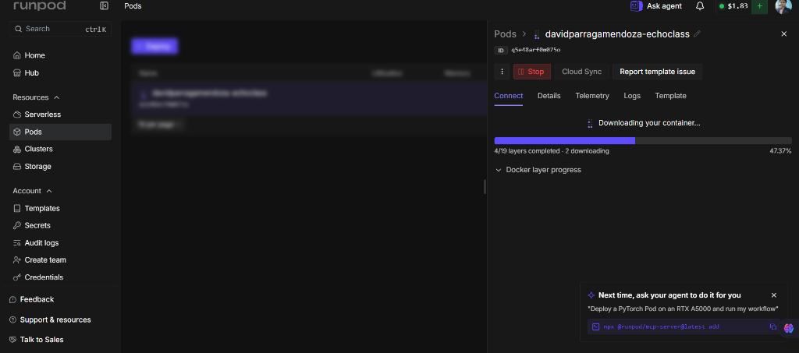
*Figura 10: Barra de progreso de descarga del contenedor en el host remoto.*

### 5.2 Secuencia de arranque en `start.sh`
Al pasar a la pestaña **`Logs`**, se observó la ejecución secuencial del script de entrada:
1. Verificación de la GPU con `nvidia-smi`.
2. Lanzamiento en background del demonio `ollama serve &`.
3. Comprobación y descarga del modelo `qwen2.5:7b`.
4. Carga de **Whisper `large-v3`** en memoria VRAM en solo **10 segundos** gracias a CTranslate2 sobre CUDA:
   ```text
   21:56:43 | INFO | whisper | Cargando modelo Whisper 'large-v3' en device='cuda' con compute_type='float16'...
   21:56:53 | INFO | whisper | Modelo 'large-v3' cargado exitosamente en device='cuda'
   ```
5. Lanzamiento de Uvicorn en el puerto `8000` y confirmación del health check (`200 OK`):

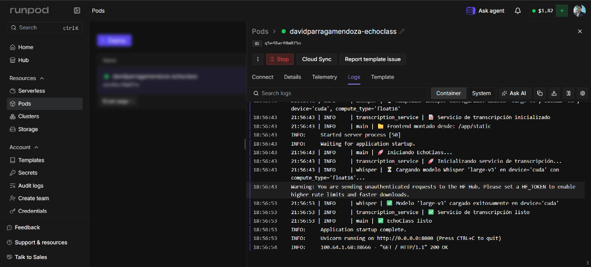
*Figura 11: Registro de logs demostrando que Whisper, Ollama y FastAPI están totalmente operativos.*

---

## 🎯 6. Fase 5: Pruebas en Vivo y Comparativa de Arquitectura

### 6.1 ¿Por qué Vercel salía "Desconectado"?
Al ingresar a la URL previa en Vercel (`https://echo-class-pearl.vercel.app`), la interfaz mostraba el estado **`🔴 Desconectado`**:

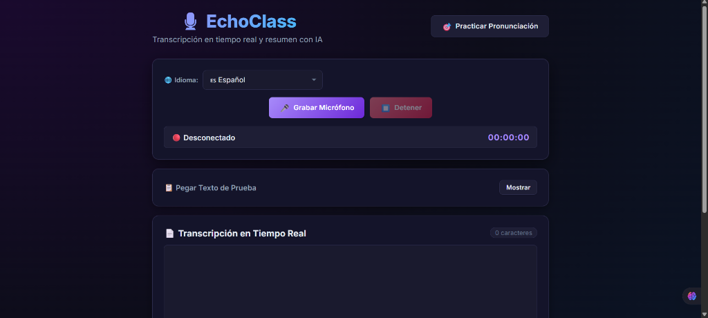
*Figura 12: Vercel solo aloja archivos estáticos y busca el WebSocket en su propio dominio, donde no hay servidor Python ni GPU.*

### 6.2 Prueba de Fuego Exitosa en RunPod
Al abrir la URL generada por RunPod:
👉 `https://q5e48arf0m075o-8000.proxy.runpod.net/practicar.html`

Se realizó una prueba real de pronunciación:
1. **Frase esperada:** `hola mi nombre es david`
2. **Audio capturado por micrófono** y transmitido vía WebSocket (`wss://`) a la GPU.
3. **Transcripción de Whisper (`large-v3`):** *"Hola, mi nombre es David."*
4. **Algoritmo de Levenshtein:** Limpieza fonética y comparación métrica.
5. **Resultado:** **`10/10 ¡Excelente! 🎯`**

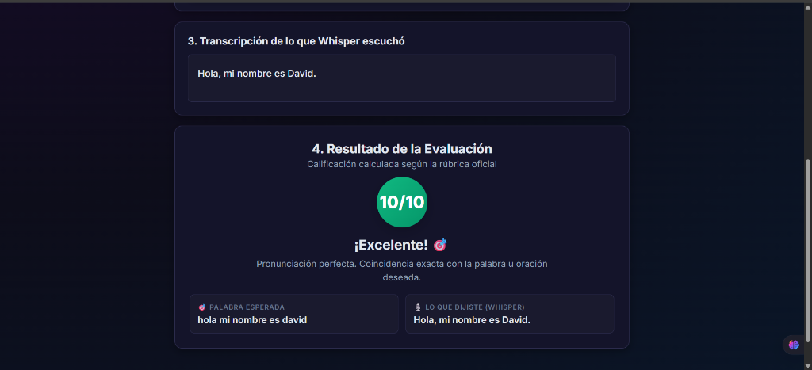
*Figura 13: Prueba de pronunciación completada en tiempo real en la nube con calificación perfecta.*

---

## ⚖️ 7. Análisis Arquitectónico: ¿Por qué NO se utiliza Serverless en el MVP de EchoClass?

Durante el proceso de evaluación para conectar el frontend de Vercel de forma permanente y económica, se analizó la posibilidad de migrar la inferencia a **RunPod Serverless**. Sin embargo, se determinó que **el modelo Serverless no es viable ni técnicamente adecuado para el MVP de EchoClass** debido a los siguientes fundamentos de ingeniería de software:

### 7.1 Protocolo Stateful (WebSockets) vs. Stateless (Serverless)
* **La realidad de WebSockets:** EchoClass implementa un canal bidireccional continuo (`transcription_ws.py` sobre `wss://`). El navegador mantiene un socket TCP abierto transmitiendo ráfagas de audio cada 5 segundos mientras el profesor habla.
* **La limitación de Serverless:** Las arquitecturas Serverless se basan en el patrón *Scale-to-Zero* (escalar a cero cuando no hay tráfico). No pueden sostener conexiones permanentes de socket en reposo: si el worker se apaga por inactividad, el canal WebSocket se destruye de inmediato y el frontend entra en estado `🔴 Desconectado`.

### 7.2 Experiencia en Tiempo Real vs. Procesamiento Batch
* En el MVP, el valor pedagógico central es la **interactividad en vivo**: el estudiante o docente ve aparecer el texto transcrito de manera progresiva en la pantalla mientras vocaliza.
* Serverless está optimizado para procesamiento por lotes (*Batch*): el usuario tendría que grabar la clase completa, presionar "Detener", enviar un archivo pesado por `HTTP POST` y esperar la respuesta final, perdiendo por completo la retroalimentación visual en tiempo real.

### 7.3 Latencia Crítica y "Cold Starts" en Modelos de IA
* **Tamaño de los modelos:** Whisper `large-v3` (~3 GB) y Ollama `qwen2.5:7b` (~4.7 GB) requieren varios gigabytes de transferencia hacia la memoria VRAM de la GPU.
* **El costo del arranque en frío:** Si una función Serverless se encuentra inactiva, la primera petición del usuario tardaría entre **15 y 30 segundos** solo en encender el contenedor y transferir los pesos a la GPU antes de transcribir la primera palabra.
* **Ventaja del Pod:** En el Pod dedicado (RTX A5000), los modelos permanecen pre-cargados en la VRAM de 24 GB, respondiendo a las ráfagas de audio con latencias ínfimas de milisegundos (< 500 ms).

### 7.4 Portabilidad y Principios de Clean Architecture
* Adoptar RunPod Serverless exigiría acoplar fuertemente el núcleo del backend a la biblioteca propietaria `runpod.serverless` y a funciones `handler(job)`, rompiendo el estándar HTTP/ASGI y la independencia tecnológica del diseño de Puertos y Adaptadores.
* La solución con **Pod Dockerizado** mantiene un servidor estándar **FastAPI + Uvicorn**, permitiendo que el mismo código se ejecute de forma transparente en una laptop local (con `start.bat`), en un servidor on-premise o en cualquier proveedor de GPU en la nube.

---

## 🏁 8. Conclusión del Despliegue

El despliegue en **RunPod mediante Pod Dedicado On-Demand** demostró ser la arquitectura óptima para el MVP de EchoClass:
1. **Rendimiento:** Inferencia acelerada por hardware con CUDA en precisión `float16` con respuesta en tiempo real.
2. **Precisión:** Transcripción fiel en español y evaluación de pronunciación perfecta (**10/10**) mediante Whisper `large-v3` y la métrica de Levenshtein.
3. **Eficiencia de Costos:** Con un costo de solo **$0.27 USD / hora** sobre una GPU profesional de 24 GB VRAM (RTX A5000), el sistema ofrece horas de cómputo ininterrumpido con un control total del presupuesto mediante la acción de pausado (`Stop`) cuando no está en sesión activa.

