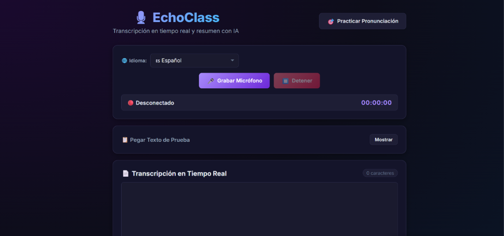
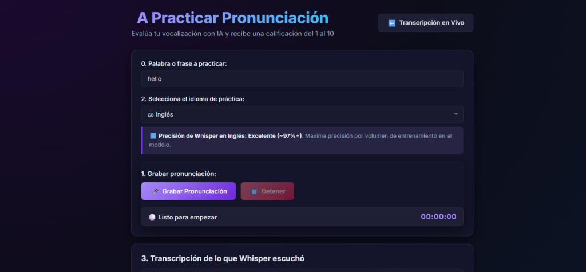

<div align="center">

# 🎙️ EchoClass
### Transcripción en tiempo real · Resúmenes con IA · Evaluación de Pronunciación

[](https://www.python.org/)
[](https://fastapi.tiangolo.com/)
[](https://github.com/SYSTRAN/faster-whisper)
[](https://ollama.ai/)
[](https://hub.docker.com/r/davidparragamendoza/echoclass)
[](https://www.runpod.io/)

**Plataforma pedagógica de IA 100% local: transcribe clases en vivo, genera minutas estructuradas con un LLM y califica la fonética del estudiante en escala del 1 al 10.**

> [!IMPORTANT]
> Privacidad total. Tu voz y tus datos **nunca** salen de tu máquina o de tu contenedor privado.

</div>

---

## 📸 Vista de la Aplicación

| Transcripción en Vivo & Resumen IA | Laboratorio de Pronunciación |
|:---:|:---:|
|  |  |

<div align="center">
  
  <br/><sub>Evaluación de pronunciación en vivo sobre NVIDIA RTX A5000 — calificación perfecta 10/10.</sub>
</div>

---

## ✨ Lo que hace EchoClass

- 🎤 **Transcripción en tiempo real** — Audio WebM/Opus → WebSocket → `faster-whisper large-v3` + filtro VAD.
- 🧠 **Resúmenes con LLM local** — `qwen2.5:7b` vía Ollama, pipeline Map-Reduce para clases largas.
- 🏆 **Score de pronunciación objetivo** — Distancia de Levenshtein normalizada, escala 1-10 definida en [`rubrica.md`](rubrica.md).
- 🔄 **GPU Offloading automático** — Libera VRAM de Whisper antes de ejecutar el LLM; la restaura al terminar.
- 🌐 **4 idiomas** — Español 🇪🇸, Inglés 🇬🇧, Ruso 🇷🇺, Chino 🇨🇳.

---

## ⚡ Instalación Rápida (Windows Local)

**Requisitos:** Python 3.9-3.12 · [Ollama](https://ollama.ai) · FFmpeg (`winget install Gyan.FFmpeg`)

```cmd
git clone https://github.com/davidparragamendoza/EchoClass.git
cd EchoClass
.\install.bat
.\start.bat
```

Abre 👉 **[http://localhost:8000](http://localhost:8000)**

> [!TIP]
> Si Ollama no corre como servicio, ejecuta `ollama serve` en una segunda terminal antes de pedir resúmenes.

---

## 🐳 Usar la Imagen Docker Publicada

La imagen ya está en Docker Hub — **no hace falta compilar nada:**

```bash
docker pull davidparragamendoza/echoclass:latest
docker run --gpus all -p 8000:8000 davidparragamendoza/echoclass:latest
```

Abre 👉 **[http://localhost:8000](http://localhost:8000)**

> Requiere Docker con soporte NVIDIA (`nvidia-container-toolkit`). Sin GPU, omite `--gpus all` para correr en modo CPU.

---

## 🛠️ Modificaste el código y quieres exportar tu imagen

```bash
docker build -f runpod/Dockerfile -t TU_USUARIO/echoclass:latest .
docker push TU_USUARIO/echoclass:latest
```

Para el despliegue completo en RunPod (GPU en la nube, variables de entorno, conectividad `wss://`) → **[GUIA_DESPLIEGUE_RUNPOD.md](GUIA_DESPLIEGUE_RUNPOD.md)**

---

## 📚 Documentación

| Documento | Descripción |
| :--- | :--- |
| [ARQUITECTURA.md](ARQUITECTURA.md) | Clean Architecture, flujos de secuencia, parámetros técnicos de Whisper y Ollama, mecanismo de GPU Offloading. |
| [GUIA_DESPLIEGUE_RUNPOD.md](GUIA_DESPLIEGUE_RUNPOD.md) | Bitácora ilustrada paso a paso: Docker build → Docker Hub → RunPod Pod GPU. |
| [rubrica.md](rubrica.md) | Formulación matemática del scoring fonético y escala oficial de calificación (1 al 10). |

---

## 🔧 Solución de Problemas

| Síntoma | Solución |
| :--- | :--- |
| `🔴 Desconectado` | Verifica que `start.bat` o el contenedor Docker estén corriendo. |
| Error en resumen | Ejecuta `ollama serve` y confirma con `ollama list` que `qwen2.5:7b` existe. |
| No detecta micrófono | Accede por `http://localhost:8000` (no por `file://`). |
| Transcripción lenta | Sin GPU detectada. Revisa drivers NVIDIA o acepta el modo CPU. |

---

## 👥 Autores

<div align="center">

| **David Párraga Mendoza** | **Deivy Prudente** |
| :---: | :---: |
| Autor Principal |  |
| [](https://www.linkedin.com/in/davidparragamendoza/) [](https://x.com/DavidParragaMen) | [](https://www.linkedin.com/in/deivy-prudente-a3bb31389/) |

</div>
